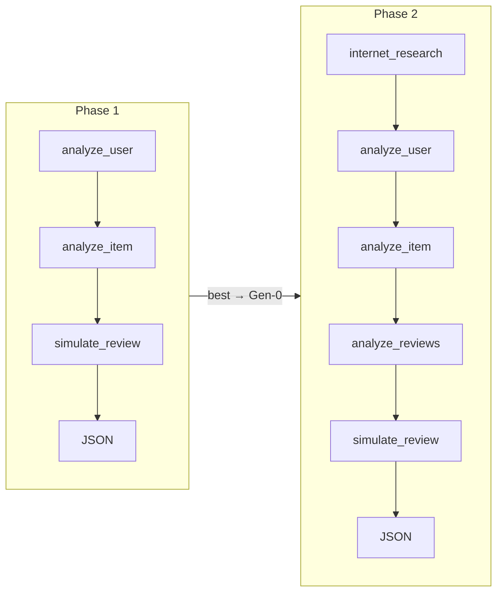

# Technical Report：兩階段 OpenEvolve × CrewAI 評論模擬進化

> 簡短版：[`TECHNICAL_REPORT_SHORT.md`](TECHNICAL_REPORT_SHORT.md) · English (full)：[`TECHNICAL_REPORT_en.md`](TECHNICAL_REPORT_en.md) · English (short)：[`TECHNICAL_REPORT_SHORT_en.md`](TECHNICAL_REPORT_SHORT_en.md)  
> 簡報大綱：[`presentation_outline.md`](presentation_outline.md)

**資料來源**：`config/openevolve_output/final_basicOnly`、`config/openevolve_output/final_agentTask`  
**解析摘要**：`docs/assets/evolution/evolution_summary.json`

---

## 目錄

1. [Abstract](#1-abstract)
2. [Key Finding](#2-key-finding)
3. [Novel Design](#3-novel-design)
4. [Evolution Analysis](#4-evolution-analysis)
5. [Design ↔ Scoring Alignment](#5-design--scoring-alignment)

---

## 1. Abstract

### 報告內容

本專案以 **OpenEvolve** 對 CrewAI **Sequential Crew** 的 agents + tasks 聯合 YAML 進行 full-rewrite 進化，目標是最大化 Simulator 的 `combined_score`（星等預測 + 評論品質）。我們採 **兩階段漸進策略（Staged Evolution）**：

- **Phase 1**（`final_basicOnly`）：3 agents × 3 tasks，打磨基礎 prompt 與 JSON 輸出契約。
- **Phase 2**（`final_agentTask`）：以 Phase 1 Best 為 Gen-0，擴充至 5 agents × 5 tasks，加入歷史評論比對與網路趨勢研究。

| 階段 | Gen-0 | Best | 提升 |
|------|-------|------|------|
| Phase 1 | 0.9100 | **0.9412** | +0.031 |
| Phase 2 | 0.9579 | **0.9999** | +0.042 |

**評分公式**：

```
combined_score = (preference_estimation + review_generation) / 2
```

- `preference_estimation`：星等 MAE（50%）
- `review_generation`：sentiment 25% + emotion 25% + **topic 50%**

---

### 📊 簡報內容（Slide 1–2）

**Slide 1 — 標題頁**

| 元素 | 內容 |
|------|------|
| 標題 | OpenEvolve × CrewAI：兩階段 Yelp 評論模擬進化 |
| 副標 | Basic（3-agent）→ Extended（5-agent） |
| 亮點數字 | **0.910 → 0.9999** `combined_score` |

**Slide 2 — 問題與目標（Abstract）**

- **任務**：模擬使用者對商家的 Yelp 評論（`stars` + `review`）
- **方法**：OpenEvolve 進化 agents/tasks prompt，非進化 Python
- **策略**：兩階段漸進——先簡後繁
- **結果表**（放上表 Gen-0 / Best / 提升）
- **評分公式**（一行 + topic 50% 標註）

**講者備註**：30 秒內說完「做什麼、怎麼做、結果多少」。

---

## 2. Key Finding

### 報告內容

#### 2.1 策略層發現（What & How — OpenEvolve 創意用法）

| # | 發現 | 說明 |
|---|------|------|
| 1 | **人設管線、機器優化文案** | 拓撲（幾個 agent、執行順序）由人設計；OpenEvolve 只優化 `role/goal/backstory` 與 `description/expected_output` |
| 2 | **兩階段接力有效** | Phase 2 Gen-0 三核心 agent 與 Phase 1 Best **文字完全一致**，銜接可驗證 |
| 3 | **先簡後繁避免搜尋爆炸** | Phase 1 在 iter 15 達 0.94 平台；證明 3-agent 有上限，需 Phase 2 擴充 |
| 4 | **歷史評論比對是最大邊際效益** | `analyze_reviews_task` + `lookup_reviews_by_user_and_item` 使 iter 45 從 0.9666 → **0.9999** |

#### 2.2 進化層發現（OpenEvolve 自動探索的策略）

| # | 發現 | 證據 |
|---|------|------|
| 1 | **Prompt 精煉 > 換工具** | Phase 1 Best 仍用 `search_*`；增益來自 `prediction_modeler` 敘述與 default 策略 |
| 2 | **MAP-Elites 容忍短期退步** | Phase 1：gen=2(0.92) < gen=1(0.94)，但 gen=3 突破至 Best |
| 3 | **探索期震盪後整合** | Phase 2：gen=1~4 在 0.94~0.95 震盪，gen=5 整合突變達 0.9999 |
| 4 | **零結構失敗** | 兩 run 各 292 個體、0 次 `combined_score=0`（structure guard 穩定） |

#### 2.3 一句話結論

> 我們用 **兩階段 OpenEvolve** 把評論模擬從 0.91 推至 **0.9999**；Phase 1 學會星等 heuristic，Phase 2 靠歷史評論 direct match 在 iter 45 完成最後躍升。

---

### 📊 簡報內容（Slide 3）

**Slide 3 — Key Finding（重點頁，建議全螢幕 bullet）**

**策略創新（Novelty）**
- ✅ 兩階段漸進：3-agent 打底 → 5-agent 衝刺
- ✅ 人設拓撲 + OpenEvolve 優化文案
- ✅ Phase 2 起點 = Phase 1 Best（已驗證）

**進化發現（Evolution）**
- 📈 Phase 1：iter 15 收斂 **0.9412**（上限）
- 🚀 Phase 2：iter 45 突破 **0.9999**
- 🔑 關鍵：`lookup_reviews_by_user_and_item` direct match
- 🛡️ 292 個體、0 次結構失敗

**視覺建議**：左側 bullet、右側放 0.91→0.94→0.9999 階梯圖。

**講者備註**：強調「不是一次進化 5 個 agent，而是分兩輪、每輪有明確 hypothesis」。

---

## 3. Novel Design

### 報告內容

#### 3.1 OpenEvolve 優化什麼、怎麼做

**What**：進化 `agents` + `tasks` 聯合 YAML（`EVOLVE-BLOCK`），在 structure guard 下不改 agent/task 名稱與數量。

**How**：
1. **Staged Handoff**：Phase 1 best → Phase 2 Gen-0 + 人工新增 2 agent / 2 task
2. **Joint bundle**：agents 與 tasks 同時突變，persona 與指令 co-adapt
3. **對齊評分**：前段查特徵、中段比對歷史評論、末段純推理輸出 JSON

#### 3.2 協作模式（Collaboration Pattern）

兩階段皆為 CrewAI **`Process.sequential`**；`simulate_review_task` **必須最後**（`serving_flow` 只解析最後輸出）。



#### 3.3 Phase 1：3 Agent × 3 Task

```
analyze_user_task  →  analyze_item_task  →  simulate_review_task
user_analyst            item_analyst           prediction_modeler
```

| Agent | Role | Goal | Backstory 要點 | Tool Use（Task 層） |
|-------|------|------|---------------|---------------------|
| `user_analyst` | Yelp User Profiler | 分析 `{user_id}` | `lookup_user_by_id`；缺資料 default 3.8 星 | `search_user_profile_data`, `search_historical_reviews_data` |
| `item_analyst` | Yelp Restaurant Analyst | 分析 `{item_id}` | `lookup_item_by_id`；缺資料重建 profile | `search_restaurant_feature_data`, `search_historical_reviews_data` |
| `prediction_modeler` | Rating & Review Predictor | 預測 stars + review | `(user_avg+item_stars)/2 ±0.5~1.0`；clamp [1,5] | **無工具** |

| Task | Agent | Description 要點 | Expected Output |
|------|-------|-----------------|-----------------|
| `analyze_user_task` | `user_analyst` | ReAct `search_*`；Action/Action Input | Markdown 使用者偏好與評分習慣 |
| `analyze_item_task` | `item_analyst` | ReAct `search_*` | Markdown 商家特徵、優缺點 |
| `simulate_review_task` | `prediction_modeler` | 綜合前兩步；禁止宣稱缺資料 | **僅 JSON** `{"stars","review"}` |

#### 3.4 Phase 2：5 Agent × 5 Task（擴充）

```
internet_research_task → analyze_user_task → analyze_item_task
  → analyze_reviews_task → simulate_review_task → JSON
```

**新增 Agent / Task**：

| 新增 | Role | Tool Use | 用途 |
|------|------|----------|------|
| `internet_researcher` | Restaurant Trend Researcher | `search_internet` | 一般評分趨勢（≤5 bullet，禁止捏造 user/item） |
| `review_analyst` | Yelp Review Analyst | `lookup_reviews_by_user_and_item` | **Direct review match** |

| Task | 重點 |
|------|------|
| `internet_research_task` | 嚴禁 `description` key 傳入 tool |
| `analyze_reviews_task` | STEP 1 強制 lookup；cross-feature fallback |
| `simulate_review_task` | 引用四份前序報告；最終 JSON |

---

### 📊 簡報內容（Slide 4–7）

**Slide 4 — Novelty：兩階段策略 + OpenEvolve How**

```
Phase 1 (3×3)  ──best──▶  Phase 2 (5×5)
人設拓撲              OpenEvolve 優化 prompt
```

- **What**：進化 agents + tasks YAML，不進化 Python
- **How**：Staged handoff + joint bundle + structure guard
- **創意**：人設管線、機器優化文案

**Slide 5 — Phase 1 Crew Diagram**

（放 ASCII / 圖）

```
user_analyst → analyze_user_task
item_analyst → analyze_item_task
prediction_modeler → simulate_review_task → JSON
```

- 3 agents、Sequential、最後一步 JSON
- Tool 表（3 行，見上表）

**Slide 6 — Phase 2 擴充**

- **新增**：`review_analyst`、`internet_researcher`
- **關鍵 task**：`analyze_reviews_task`（direct match）
- 5-step pipeline 圖（見上）

**Slide 7 — Agent Design 總表（可選 deep dive）**

| Agent | Tools | 策略一句話 |
|-------|-------|-----------|
| user_analyst | search_user*, search_historical* | 缺資料 → 3.8 星 |
| item_analyst | search_restaurant*, search_historical* | 查特徵與輿論 |
| review_analyst | lookup_reviews_by_user_and_item | 歷史 direct match |
| internet_researcher | search_internet | 僅 general 趨勢 |
| prediction_modeler | 無 | 公式 + 綜合報告 → JSON |

**視覺建議**：Slide 5–6 用橫向 pipeline 圖；Slide 7 用精簡表。

**講者備註**：強調 `prediction_modeler` 無工具——強迫它依賴結構化中間輸出，減少幻覺。

---

## 4. Evolution Analysis

### 報告內容

#### 4.1 實驗設定

| 參數 | 值 |
|------|-----|
| Iterations | 50 · checkpoint every 5 |
| LLM | `gpt-4.1-mini` |
| Population / Islands | 50 / 3 |
| Mode | full rewrite · seed 42 |
| Evaluator | `openevolve_evaluator.py` → `combined_score` |

#### 4.2 Checkpoint 分數軌跡

**Phase 1 — `final_basicOnly`**

| Checkpoint | Iter | Best score |
|------------|------|------------|
| checkpoint_5 | 5 | 0.9335 |
| checkpoint_10 | 10 | 0.9355 |
| checkpoint_15 | 15 | **0.9412** |
| checkpoint_20–50 | 20–50 | 0.9412（平台） |

**Phase 2 — `final_agentTask`**

| Checkpoint | Iter | Best score |
|------------|------|------------|
| checkpoint_5 | 5 | 0.9666 |
| checkpoint_10–40 | 10–40 | 0.9666（平台） |
| checkpoint_45 | 45 | **0.9999** |
| checkpoint_50 | 50 | 0.9999 |

#### 4.3 祖先鏈（Evolution Path）

```
Phase 1: gen0(0.91) → gen1(0.94) → gen2(0.92) → gen3(0.9412) Best
Phase 2: gen0(0.96) → gen1~4(0.94~0.95) → gen5(0.9999) Best
```

#### 4.4 OpenEvolve 發現的策略（Gen-0 vs Best diff）

| 階段 | 策略 | 具體變化 |
|------|------|---------|
| P1 | Prompt 精煉 | `prediction_modeler` 改為 data-scientist 敘述；強化 default 3.8 星 |
| P1 | 工具不變 | 仍用 `search_*`；分數來自語意而非換 tool |
| P2 | Direct match | `analyze_reviews_task` 提取 matched stars / snippet |
| P2 | 多源綜合 | `simulate_review_task` 引用四份前序報告 |
| P2 | Context 紀律 | `internet_research_task` 收斂 ≤5 bullet |

#### 4.5 族群統計

| Run | 個體數 | 0 分次數 | 最低 | 中位數 | 最高 |
|-----|--------|---------|------|--------|------|
| `final_basicOnly` | 292 | 0 | 0.8694 | 0.9259 | 0.9412 |
| `final_agentTask` | 292 | 0 | 0.9237 | 0.9455 | 0.9999 |

#### 4.6 Visualizer 分析

```bash
make visualize OUTPUT=config/openevolve_output/final_basicOnly
make visualize OUTPUT=config/openevolve_output/final_agentTask
# → http://127.0.0.1:8080
```

| 視圖 | 簡報用途 |
|------|---------|
| Evolution tree | 展示分支深度、Phase 2 gen=5 |
| Performance tab | Phase 1 早平、Phase 2 iter 45 陡升 |
| Code diff viewer | Gen-0 vs Best prompt 突變 |
| MAP-Elites grid | complexity / diversity 分佈 |

**Gen-0 vs Best 檔案**：

| 階段 | Gen-0 | Best |
|------|-------|------|
| Phase 1 | `docs/assets/evolution/final_basicOnly_gen0.yaml` | `.../final_basicOnly/best/best_program.yaml` |
| Phase 2 | `docs/assets/evolution/final_agentTask_gen0.yaml` | `.../final_agentTask/best/best_program.yaml` |

---

### 📊 簡報內容（Slide 8–10）

**Slide 8 — Evolution：分數軌跡（雙折線或階梯圖）**

| | Phase 1 | Phase 2 |
|--|---------|---------|
| 起點 | 0.910 | 0.958 |
| 平台 | iter 15 → **0.941** | iter 5–40 → **0.967** |
| 突破 | — | iter 45 → **0.9999** |

- 附 checkpoint 簡表（各 3–4 行即可）

**Slide 9 — Evolution Path（祖先鏈 + Visualizer）**

```
P1: gen0 → gen1 → gen2↓ → gen3 Best
P2: gen0 → gen1~4 震盪 → gen5 Best
```

- **截圖占位**：Evolution tree（Phase 2）
- **截圖占位**：Performance 曲線（iter 45 跳點）
- **講點**：MAP-Elites 允許短期退步；gen=5 整合前期突變

**Slide 10 — Gen-0 vs Best：OpenEvolve 發現的 3 條策略**

1. **Direct review 捷徑** — `analyze_reviews_task` 強化 matched stars
2. **多源綜合** — `simulate_review_task` 吃四份報告
3. **Context 紀律** — internet research 限 5 bullet

- **截圖占位**：Visualizer diff viewer（Phase 2 Best vs Gen-0）
- 可選：structure guard → 292 個體、0 次失敗

**講者備註**：這三頁是評分「depth of evolution analysis」的核心；務必放 visualizer 截圖。

---

## 5. Design ↔ Scoring Alignment

### 報告內容

評分公式驅動管線設計：每個設計決策對應可量化的子指標。

| 設計決策 | 影響子指標 | Phase 1 證據 | Phase 2 證據 |
|---------|-----------|-------------|-------------|
| `(user_avg + item_stars)/2 ± 調整` | `preference_estimation` | 0.91 → 0.94 | Gen-0 已 0.96 |
| 缺資料 default 3.8 星 | `preference_estimation` | 減少幻覺 MAE | 沿用 |
| `lookup_reviews_by_user_and_item` | 星等 + **topic** | — | iter 45 → 0.9999 |
| 評論引用 strengths/weaknesses | `review_generation`（**topic 50%**） | Best prompt 強化 | Best 明確要求 |
| 開頭情緒對齊 stars | `review_generation`（emotion 25%） | simulate_review 規則 | 沿用並強化 |
| `internet_research` 僅 general | 避免幻覺、省 token | — | Best 保留 ≤5 bullet |
| 最終 JSON 契約 | 解析成功率 | Phase 1 打磨 | Phase 2 沿用 |

**因果鏈（簡化）**：

```
查準 user_avg / item_stars  →  preference_estimation ↑
direct match 歷史評論       →  星等 MAE ↓ + 文風 topic ↑
提及 categories/attributes  →  topic 50% ↑
```

---

### 📊 簡報內容（Slide 11 + 結尾）

**Slide 11 — Design ↔ Scoring（對齊表，精簡 4 行）**

| 我們的設計 | 對應評分 |
|-----------|---------|
| 星等公式 heuristic | 星等 MAE ↓ |
| direct review match | 星等 + topic ↑ |
| 評論提 strengths/weaknesses | topic（**權重最高**）↑ |
| JSON 輸出契約 | 解析穩定 |

**Slide 12 — 結論與限制（可併入 Slide 11 下半）**

**Takeaways**
- 兩階段漸進 > 一次進化 5 agent
- Phase 1 上限 ~0.94 → 必須擴充
- Phase 2 iter 45 是關鍵突破點

**Limitations**（小字或 oral 帶過）
- 進化可能用 `TASKS=1` 快評；建議 `make test` 全量驗證
- agent 寫 lookup、task 寫 search，尚未完全統一

**套用 Best**：

```bash
cp config/openevolve_output/final_agentTask/best/best_program.yaml ...
make test
```

---

## Appendix

### 簡報頁數對照（建議 10–12 頁）

| 頁 | 章節 | 標題 |
|----|------|------|
| 1–2 | Abstract | 標題 + 問題目標 |
| 3 | Key Finding | 核心發現 |
| 4–7 | Novel Design | 策略、Phase 1/2 Crew、Agent 表 |
| 8–10 | Evolution Analysis | 軌跡、祖先鏈、Gen-0 vs Best |
| 11–12 | Design | 評分對齊 + 結論 |

### 解析工具

```bash
uv run python scripts/parse_evolution_run.py
```

### Visualizer 依賴（首次）

```bash
git clone --depth 1 https://github.com/algorithmicsuperintelligence/openevolve.git third_party/openevolve
```

---

*報告產生時間：2026-06-20。數據來自 `final_basicOnly` 與 `final_agentTask` checkpoint 解析。*
