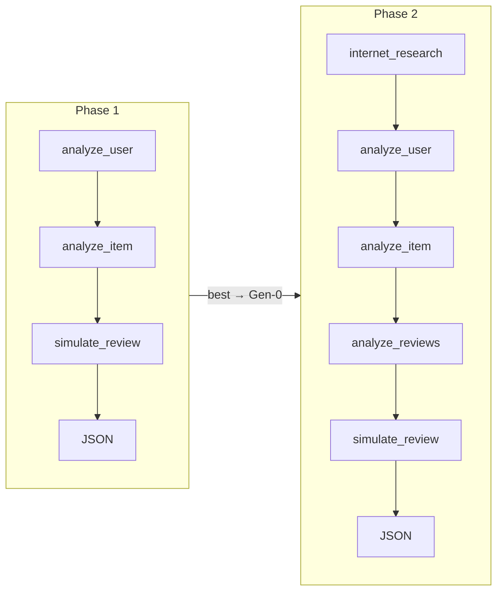
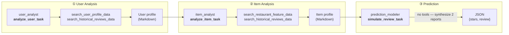

# Technical Report: Two-Stage OpenEvolve × CrewAI Review Simulation Evolution

> Short version (ZH): [`TECHNICAL_REPORT_SHORT.md`](TECHNICAL_REPORT_SHORT.md) · Short version (EN): [`TECHNICAL_REPORT_SHORT_en.md`](TECHNICAL_REPORT_SHORT_en.md)  
> Plain text (EN): [`TECHNICAL_REPORT_en.txt`](TECHNICAL_REPORT_en.txt)  
> Presentation outline: [`presentation_outline_en.md`](presentation_outline_en.md) · 中文版：[`TECHNICAL_REPORT.md`](TECHNICAL_REPORT.md)

**Data sources**: `config/openevolve_output/final_basicOnly`, `config/openevolve_output/final_agentTask`  
**Parsed summary**: `docs/assets/evolution/evolution_summary.json`

---

## Table of Contents

1. [Abstract](#1-abstract)
2. [Key Finding](#2-key-finding)
3. [Novel Design](#3-novel-design)
4. [Evolution Analysis](#4-evolution-analysis)
5. [Design ↔ Scoring Alignment](#5-design--scoring-alignment)

---

## 1. Abstract

### Report Content

This project uses **OpenEvolve** to perform full-rewrite evolution on a joint **agents + tasks YAML** for a CrewAI **Sequential Crew**, with the goal of maximizing the Simulator’s `combined_score` (rating prediction + review quality). We adopt a **two-stage staged evolution** strategy:

- **Phase 1** (`final_basicOnly`): 3 agents × 3 tasks — refine base prompts and the JSON output contract.
- **Phase 2** (`final_agentTask`): use Phase 1 Best as Gen-0, extend to 5 agents × 5 tasks, adding historical review matching and internet trend research.

| Phase | Gen-0 | Best | Gain |
|-------|-------|------|------|
| Phase 1 | 0.9100 | **0.9412** | +0.031 |
| Phase 2 | 0.9579 | **0.9999** | +0.042 |

**Scoring formula**:

```
combined_score = (preference_estimation + review_generation) / 2
```

- `preference_estimation`: star-rating MAE (50%)
- `review_generation`: sentiment 25% + emotion 25% + **topic 50%**

---

### 📊 Presentation Content (Slides 1–2)

**Slide 1 — Title**

| Element | Content |
|---------|---------|
| Title | OpenEvolve × CrewAI: Two-Stage Yelp Review Simulation Evolution |
| Subtitle | Basic (3-agent) → Extended (5-agent) |
| Highlight | **0.910 → 0.9999** `combined_score` |

**Slide 2 — Problem & Goals (Abstract)**

- **Task**: Simulate a user’s Yelp review of a business (`stars` + `review`)
- **Method**: OpenEvolve evolves agents/tasks prompts — not Python code
- **Strategy**: Two-stage staged evolution — simple first, complex later
- **Results table** (Gen-0 / Best / Gain from table above)
- **Scoring formula** (one line + note topic 50% weight)

**Speaker note**: Cover what, how, and results in ~30 seconds.

---

## 2. Key Finding

### Report Content

#### 2.1 Strategy-Level Findings (What & How — Creative OpenEvolve Usage)

| # | Finding | Explanation |
|---|---------|-------------|
| 1 | **Human-designed pipeline, machine-optimized prompts** | Topology (agent count, execution order) is human-designed; OpenEvolve only optimizes `role/goal/backstory` and `description/expected_output` |
| 2 | **Two-stage handoff works** | Phase 2 Gen-0 core agents are **text-identical** to Phase 1 Best — handoff verified |
| 3 | **Simple-first avoids search explosion** | Phase 1 plateaus at 0.94 by iter 15; proves 3-agent ceiling → Phase 2 extension needed |
| 4 | **Historical review matching = largest marginal gain** | `analyze_reviews_task` + `lookup_reviews_by_user_and_item` drives iter 45 from 0.9666 → **0.9999** |

#### 2.2 Evolution-Level Findings (Strategies OpenEvolve Discovered)

| # | Finding | Evidence |
|---|---------|----------|
| 1 | **Prompt refinement > tool swapping** | Phase 1 Best still uses `search_*`; gains from `prediction_modeler` narrative and default strategy |
| 2 | **MAP-Elites tolerates short-term regression** | Phase 1: gen=2(0.92) < gen=1(0.94), but gen=3 breaks through to Best |
| 3 | **Oscillation then integration during exploration** | Phase 2: gen=1~4 oscillates at 0.94~0.95; gen=5 integrates mutations → 0.9999 |
| 4 | **Zero structural failures** | 292 individuals per run, 0× `combined_score=0` (structure guard stable) |

#### 2.3 One-Line Conclusion

> We use **two-stage OpenEvolve** to push review simulation from 0.91 to **0.9999**; Phase 1 learns star heuristics; Phase 2 completes the final leap at iter 45 via historical review direct match.

---

### 📊 Presentation Content (Slide 3)

**Slide 3 — Key Finding (hero slide, full-screen bullets recommended)**

**Strategic novelty**
- ✅ Two-stage evolution: 3-agent foundation → 5-agent sprint
- ✅ Human topology + OpenEvolve prompt optimization
- ✅ Phase 2 start = Phase 1 Best (verified)

**Evolution discoveries**
- 📈 Phase 1: converges at iter 15 → **0.9412** (ceiling)
- 🚀 Phase 2: breakthrough at iter 45 → **0.9999**
- 🔑 Key: `lookup_reviews_by_user_and_item` direct match
- 🛡️ 292 individuals, 0 structural failures

**Visual suggestion**: Bullets on the left; 0.91 → 0.94 → 0.9999 step chart on the right.

**Speaker note**: Emphasize “not evolving 5 agents at once — two rounds, each with a clear hypothesis.”

---

## 3. Novel Design

### Report Content

#### 3.1 What OpenEvolve Optimizes and How

**What**: Evolve joint `agents` + `tasks` YAML (`EVOLVE-BLOCK`); under structure guard, agent/task names and counts are fixed.

**How**:
1. **Staged handoff**: Phase 1 best → Phase 2 Gen-0 + manually add 2 agents / 2 tasks
2. **Joint bundle**: agents and tasks mutate together — personas and instructions co-adapt
3. **Metric-aligned pipeline**: early tasks fetch features; mid task matches historical reviews; final task pure reasoning → JSON

#### 3.2 Collaboration Pattern

Both phases use CrewAI **`Process.sequential`**; `simulate_review_task` **must be last** (`serving_flow` parses only the final output).



#### 3.3 Phase 1: 3 Agents × 3 Tasks

```
analyze_user_task  →  analyze_item_task  →  simulate_review_task
user_analyst            item_analyst           prediction_modeler
```

| Agent | Role | Goal | Backstory highlights | Tool use (task layer) |
|-------|------|------|---------------------|----------------------|
| `user_analyst` | Yelp User Profiler | Analyze `{user_id}` | `lookup_user_by_id`; default 3.8 stars if missing | `search_user_profile_data`, `search_historical_reviews_data` |
| `item_analyst` | Yelp Restaurant Analyst | Analyze `{item_id}` | `lookup_item_by_id`; reconstruct profile if missing | `search_restaurant_feature_data`, `search_historical_reviews_data` |
| `prediction_modeler` | Rating & Review Predictor | Predict stars + review | `(user_avg+item_stars)/2 ±0.5~1.0`; clamp [1,5] | **No tools** |

| Task | Agent | Description highlights | Expected output |
|------|-------|------------------------|-----------------|
| `analyze_user_task` | `user_analyst` | ReAct `search_*`; Action/Action Input | Markdown user preferences and rating habits |
| `analyze_item_task` | `item_analyst` | ReAct `search_*` | Markdown business features, pros/cons |
| `simulate_review_task` | `prediction_modeler` | Synthesize prior steps; never claim missing data | **JSON only** `{"stars","review"}` |

#### 3.4 Phase 2: 5 Agents × 5 Tasks (Extension)

```
internet_research_task → analyze_user_task → analyze_item_task
  → analyze_reviews_task → simulate_review_task → JSON
```

**New agents / tasks**:

| New | Role | Tool use | Purpose |
|-----|------|----------|---------|
| `internet_researcher` | Restaurant Trend Researcher | `search_internet` | General rating trends (≤5 bullets; no fabricated user/item data) |
| `review_analyst` | Yelp Review Analyst | `lookup_reviews_by_user_and_item` | **Direct review match** |

| Task | Highlights |
|------|------------|
| `internet_research_task` | Never pass `description` key to tool |
| `analyze_reviews_task` | STEP 1 mandatory lookup; cross-feature fallback |
| `simulate_review_task` | Reference four prior reports; final JSON |

---

### 📊 Presentation Content (Slides 4–7)

**Slide 4 — Novelty: Two-Stage Strategy + OpenEvolve How**

```
Phase 1 (3×3)  ──best──▶  Phase 2 (5×5)
Human topology         OpenEvolve optimizes prompts
```

- **What**: Evolve agents + tasks YAML, not Python
- **How**: Staged handoff + joint bundle + structure guard
- **Creative angle**: Human-designed pipeline, machine-optimized wording

**Slide 5 — Phase 1 Crew Diagram**

Sequential Crew — 3 agents × 3 tasks — final step must output JSON



- 3 agents, Sequential, final step → JSON
- Tool table (3 rows, see §3.3)

**Slide 6 — Phase 2 Extension**

Sequential Crew — 5 agents × 5 tasks — extends Phase 1 with 2 new agents


- **Added**: `review_analyst`, `internet_researcher`
- **Key task**: `analyze_reviews_task` (direct match via `lookup_reviews_by_user_and_item`)
- Full details: see §3.4

**Slide 7 — Agent Design Summary (optional deep dive)**

| Agent | Tools | One-line strategy |
|-------|-------|-------------------|
| user_analyst | search_user*, search_historical* | Missing data → 3.8 stars |
| item_analyst | search_restaurant*, search_historical* | Features + sentiment |
| review_analyst | lookup_reviews_by_user_and_item | Historical direct match |
| internet_researcher | search_internet | General trends only |
| prediction_modeler | none | Formula + synthesis → JSON |

**Visual suggestion**: Horizontal pipeline for Slides 5–6; compact table for Slide 7.

**Speaker note**: Highlight that `prediction_modeler` has no tools — forces reliance on structured intermediate output, reducing hallucination.

---

## 4. Evolution Analysis

### Report Content

#### 4.1 Experimental Setup

| Parameter | Value |
|-----------|-------|
| Iterations | 50 · checkpoint every 5 |
| LLM | `gpt-4.1-mini` |
| Population / Islands | 50 / 3 |
| Mode | full rewrite · seed 42 |
| Evaluator | `openevolve_evaluator.py` → `combined_score` |

#### 4.2 Checkpoint Score Trajectory

**Phase 1 — `final_basicOnly`**

| Checkpoint | Iter | Best score |
|------------|------|------------|
| checkpoint_5 | 5 | 0.9335 |
| checkpoint_10 | 10 | 0.9355 |
| checkpoint_15 | 15 | **0.9412** |
| checkpoint_20–50 | 20–50 | 0.9412 (plateau) |

**Phase 2 — `final_agentTask`**

| Checkpoint | Iter | Best score |
|------------|------|------------|
| checkpoint_5 | 5 | 0.9666 |
| checkpoint_10–40 | 10–40 | 0.9666 (plateau) |
| checkpoint_45 | 45 | **0.9999** |
| checkpoint_50 | 50 | 0.9999 |

#### 4.3 Ancestry Chain (Evolution Path)

```
Phase 1: gen0(0.91) → gen1(0.94) → gen2(0.92) → gen3(0.9412) Best
Phase 2: gen0(0.96) → gen1~4(0.94~0.95) → gen5(0.9999) Best
```

#### 4.4 Strategies OpenEvolve Discovered (Gen-0 vs Best diff)

| Phase | Strategy | Concrete change |
|-------|----------|-----------------|
| P1 | Prompt refinement | `prediction_modeler` → data-scientist narrative; stronger 3.8-star default |
| P1 | Tools unchanged | Still `search_*`; gains from semantics, not tool swap |
| P2 | Direct match | `analyze_reviews_task` extracts matched stars / snippet |
| P2 | Multi-source synthesis | `simulate_review_task` references four prior reports |
| P2 | Context discipline | `internet_research_task` capped at ≤5 bullets |

#### 4.5 Population Statistics

| Run | Individuals | Zero-score count | Min | Median | Max |
|-----|-------------|------------------|-----|--------|-----|
| `final_basicOnly` | 292 | 0 | 0.8694 | 0.9259 | 0.9412 |
| `final_agentTask` | 292 | 0 | 0.9237 | 0.9455 | 0.9999 |

#### 4.6 Visualizer Analysis

```bash
make visualize OUTPUT=config/openevolve_output/final_basicOnly
make visualize OUTPUT=config/openevolve_output/final_agentTask
# → http://127.0.0.1:8080
```

| View | Presentation use |
|------|------------------|
| Evolution tree | Branch depth; Phase 2 gen=5 |
| Performance tab | Phase 1 early plateau; Phase 2 jump at iter 45 |
| Code diff viewer | Gen-0 vs Best prompt mutations |
| MAP-Elites grid | complexity / diversity distribution |

**Gen-0 vs Best files**:

| Phase | Gen-0 | Best |
|-------|-------|------|
| Phase 1 | `docs/assets/evolution/final_basicOnly_gen0.yaml` | `.../final_basicOnly/best/best_program.yaml` |
| Phase 2 | `docs/assets/evolution/final_agentTask_gen0.yaml` | `.../final_agentTask/best/best_program.yaml` |

---

### 📊 Presentation Content (Slides 8–10)

**Slide 8 — Evolution: Score Trajectory (dual line or step chart)**

| | Phase 1 | Phase 2 |
|--|---------|---------|
| Start | 0.910 | 0.958 |
| Plateau | iter 15 → **0.941** | iter 5–40 → **0.967** |
| Breakthrough | — | iter 45 → **0.9999** |

- Include compact checkpoint table (3–4 rows each)

**Slide 9 — Evolution Path (ancestry + Visualizer)**

```
P1: gen0 → gen1 → gen2↓ → gen3 Best
P2: gen0 → gen1~4 oscillation → gen5 Best
```

- **Screenshot placeholder**: Evolution tree (Phase 2)
- **Screenshot placeholder**: Performance curve (iter 45 jump)
- **Talking point**: MAP-Elites allows short regression; gen=5 integrates prior mutations

**Slide 10 — Gen-0 vs Best: 3 Strategies OpenEvolve Discovered**

1. **Direct review shortcut** — `analyze_reviews_task` strengthens matched stars
2. **Multi-source synthesis** — `simulate_review_task` consumes four reports
3. **Context discipline** — internet research limited to 5 bullets

- **Screenshot placeholder**: Visualizer diff viewer (Phase 2 Best vs Gen-0)
- Optional: structure guard → 292 individuals, 0 failures

**Speaker note**: These three slides are core for “depth of evolution analysis” scoring — include visualizer screenshots.

---

## 5. Design ↔ Scoring Alignment

### Report Content

The scoring formula drives pipeline design: each decision maps to a measurable sub-metric.

| Design decision | Sub-metric impact | Phase 1 evidence | Phase 2 evidence |
|-----------------|-------------------|------------------|------------------|
| `(user_avg + item_stars)/2 ± adjustment` | `preference_estimation` | 0.91 → 0.94 | Gen-0 already 0.96 |
| Default 3.8 stars when data missing | `preference_estimation` | Reduces hallucinated MAE | Retained |
| `lookup_reviews_by_user_and_item` | Stars + **topic** | — | iter 45 → 0.9999 |
| Review cites strengths/weaknesses | `review_generation` (**topic 50%**) | Best prompt strengthened | Explicitly required in Best |
| Opening sentiment aligns with stars | `review_generation` (emotion 25%) | simulate_review rules | Retained and strengthened |
| `internet_research` general only | Avoid hallucination, save tokens | — | Best retains ≤5 bullets |
| Final JSON contract | Parse success rate | Phase 1 refined | Phase 2 retained |

**Causal chain (simplified)**:

```
Accurate user_avg / item_stars     →  preference_estimation ↑
Direct match on historical review  →  star MAE ↓ + topic ↑
Mention categories/attributes      →  topic 50% ↑
```

---

### 📊 Presentation Content (Slides 11 + Closing)

**Slide 11 — Design ↔ Scoring (compact 4-row table)**

| Our design | Scoring impact |
|------------|----------------|
| Star-rating heuristic | Star MAE ↓ |
| Direct review match | Stars + topic ↑ |
| Review cites strengths/weaknesses | Topic (**highest weight**) ↑ |
| JSON output contract | Stable parsing |

**Slide 12 — Conclusion & Limitations (can merge with bottom of Slide 11)**

**Takeaways**
- Two-stage evolution > evolving 5 agents at once
- Phase 1 ceiling ~0.94 → extension required
- Phase 2 iter 45 is the key breakthrough

**Limitations** (small text or oral)
- Evolution may use `TASKS=1` fast eval; recommend full `make test` validation
- Agents mention lookup, tasks mention search — not fully unified yet

**Apply Best**:

```bash
cp config/openevolve_output/final_agentTask/best/best_program.yaml ...
make test
```

---

## Appendix

### Slide-to-Section Mapping (recommended 10–12 slides)

| Slide | Section | Title |
|-------|---------|-------|
| 1–2 | Abstract | Title + problem & goals |
| 3 | Key Finding | Core findings |
| 4–7 | Novel Design | Strategy, Phase 1/2 crew, agent table |
| 8–10 | Evolution Analysis | Trajectory, ancestry, Gen-0 vs Best |
| 11–12 | Design | Scoring alignment + conclusion |

### Parsing Tool

```bash
uv run python scripts/parse_evolution_run.py
```

### Visualizer Setup (first time)

```bash
git clone --depth 1 https://github.com/algorithmicsuperintelligence/openevolve.git third_party/openevolve
```

---

*Report generated: 2026-06-20. Data from `final_basicOnly` and `final_agentTask` checkpoint parsing.*
